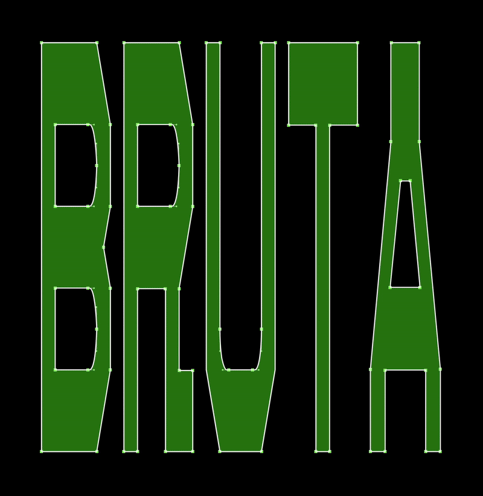

# BRUTA TYPE

**Monospaced. Geometric. Unapologetic.**

Bruta is a bold and expressive typeface with a rigid skeleton and zero tolerance for ornament.  
It’s built for order, but comfortable with dissent.

With squared shapes, heavy structure and sharp cuts, Bruta speaks in a tone somewhere between brutalist signage and bureaucratic sarcasm.  
Ideal for manifestos, angry labels, absurd forms, institutional posters, and typographic deadpan.

Available for free under the SIL Open Font License.  
No italics. No apologies.

→ [Web specimen](https://dnlzqn.xyz/bruta)

---

## License

**SIL Open Font License (OFL).**

You can use, modify, and redistribute Bruta for both personal and commercial projects.  
Just don’t sell it as a standalone product, and always include the original license.  
No added restrictions. No nonsense.

[Read the full license →](https://scripts.sil.org/OFL)

---

## Author

Made in 2025 by [dnlzqn.xyz](https://www.dnlzqn.xyz/)  
Contact: [daniel.uzquiano@gmail.com](mailto:daniel.uzquiano@gmail.com)

Drawn in Glyphs. Released with restraint.

---
